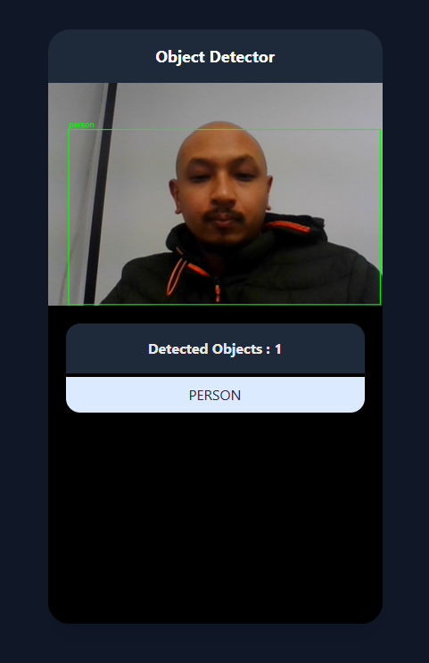

# 📱 React Object Detector (Mobile UI)

A simple React-based object detection web application using TensorFlow.js and the COCO-SSD model.  
It uses the webcam to detect real-world objects in real time and displays the results with a mobile-like user interface.

---

## 🚀 Features

- Real-time object detection using webcam
- COCO-SSD model from TensorFlow.js
- Mobile-style UI (375x667 px, rounded screen)
- Built with React + Vite + Tailwind CSS
- Runs entirely in the browser

---

## 🖼️ Demo



---

## 🛠️ Installation

```bash
git clone https://github.com/ashon-shakya/object-detect.git
cd object-detect
yarn
yarn dev
```
